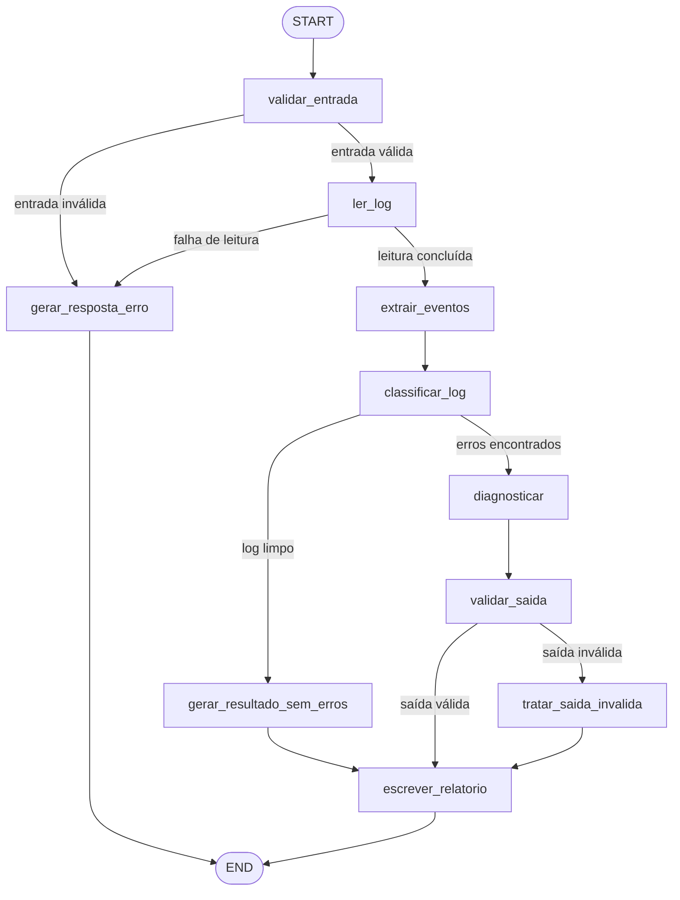

# JavaLog Agent

> Mini-Projeto — Módulo 2: Agentes de IA e Automação

| Identificação | Informação |
|---|---|
| **Projeto** | JavaLog Agent |
| **Autor** | Edenilson Alves Gonçalves |
| **Curso** | SCTEC — IA para DEVs |
| **Turma** | Turma 1 |
| **Módulo** | Módulo 2 — Agentes de IA e Automação |

Agente de diagnóstico para logs Java e Spring Boot, implementado com Python, LangGraph, LangChain e saída estruturada com Pydantic.

O fluxo valida o arquivo, lê o log por uma ferramenta restrita, extrai eventos e exceções, classifica o problema, produz um diagnóstico e grava um relatório Markdown.

## Funcionalidades

- validação determinística do arquivo de entrada;
- leitura restrita ao diretório `examples/logs`;
- suporte a arquivos `.log` e `.txt`;
- limite máximo de 5 MB por arquivo;
- extração de exceções Java e eventos `ERROR` e `WARN`;
- classificação determinística do log;
- diagnóstico estruturado com LLM;
- fallback determinístico quando o LLM falha ou não está configurado;
- validação da saída com Pydantic;
- escrita restrita ao diretório `output`;
- testes com FakeLLM, sem chamadas externas.

## Arquitetura

Fluxo principal:

## Estrutura

    java-log-agent/
    ├── docs/
    │   └── prompts/
    ├── examples/
    │   ├── logs/
    │   └── results/
    ├── output/
    ├── src/
    │   ├── graph.py
    │   ├── main.py
    │   ├── nodes.py
    │   ├── schemas.py
    │   ├── state.py
    │   ├── tools.py
    │   └── validation.py
    ├── tests/
    │   ├── fake_llm.py
    │   ├── test_routing.py
    │   ├── test_tools.py
    │   └── test_validation.py
    ├── .env.example
    ├── .gitignore
    └── requirements.txt

## Requisitos

- Python 3.12;
- dependências listadas em `requirements.txt`;
- chave da OpenAI opcional.

## Instalação no PowerShell

~~~powershell
python -m venv .venv

.\.venv\Scripts\Activate.ps1

python -m pip install -r requirements.txt
~~~

Para usar o diagnóstico com OpenAI:

~~~powershell
Copy-Item .env.example .env
~~~

Depois, informe a chave no arquivo `.env`:

~~~text
OPENAI_API_KEY=sua_chave
~~~

Sem a chave, logs com erros seguem para o fallback determinístico.

## Execução

Log com exceção:

~~~powershell
.\.venv\Scripts\python.exe -m src.main `
    examples\logs\null-pointer-exception.log
~~~

Log com erro de criação de bean:

~~~powershell
.\.venv\Scripts\python.exe -m src.main `
    examples\logs\bean-creation-error.log
~~~

Log sem erros relevantes:

~~~powershell
.\.venv\Scripts\python.exe -m src.main `
    examples\logs\application-clean.log
~~~

Os relatórios são gravados em `output`.

## Exemplos versionados

Entradas:

- `examples/logs/application-clean.log`;
- `examples/logs/bean-creation-error.log`;
- `examples/logs/null-pointer-exception.log`.

Saídas correspondentes:

- `examples/results/report_application-clean.md`;
- `examples/results/report_bean-creation-error.md`;
- `examples/results/report_null-pointer-exception.md`.

Os relatórios em `examples/results` demonstram a execução sem uma chave real da OpenAI. Por isso, os logs com erros usam o modo `fallback`, enquanto o log limpo usa o modo `deterministic`.

## Testes

Executar a suíte completa:

~~~powershell
.\.venv\Scripts\python.exe -m pytest -q
~~~

Resultado validado:

~~~text
26 passed
~~~

Cobertura funcional da suíte:

- 7 testes de roteamento do StateGraph;
- 11 testes das ferramentas;
- 8 testes de validação de entrada.

## Segurança e limites

- arquivos de entrada devem estar em `examples/logs`;
- somente extensões `.log` e `.txt` são aceitas;
- arquivos vazios, inexistentes ou acima de 5 MB são rejeitados;
- path traversal é bloqueado antes da leitura;
- relatórios são gravados somente em `output`;
- nomes de relatório são sanitizados;
- o modelo não recebe acesso a shell ou escrita irrestrita;
- a FakeLLM é injetada somente pelos testes;
- falhas do LLM são convertidas em estado observável;
- o fallback permite concluir o diagnóstico sem chamada externa.

## Estados finais principais

| Status | Significado |
|---|---|
| `success` | Diagnóstico válido produzido pelo LLM |
| `success_fallback` | Diagnóstico determinístico após falha ou ausência do LLM |
| `success_no_errors` | Log sem erros relevantes |
| `error` | Entrada inválida ou falha de leitura |

## O problema

Desenvolvedores e equipes de suporte perdem muito tempo analisando logs longos e complexos de aplicações Java/Spring Boot para identificar a causa raiz de exceções e erros. O JavaLog Agent automatiza essa análise, entregando um diagnóstico estruturado com evidências extraídas do próprio log.

## Principais decisões tomadas

- **LLM injetado como dependência** (`create_graph(llm=...)`): o nó de diagnóstico não detecta objetos de teste por atributo; produção e testes exercitam o mesmo caminho de código.
- **Chamada única ao LLM**, apenas com evidências extraídas por regex (máximo 5 exceções + 5 eventos), controlando custo e contexto.
- **Classificação determinística antes do LLM**: logs limpos geram relatório determinístico e nunca acionam o modelo.
- **Fallback determinístico** para ausência de chave, falha do modelo ou saída estruturalmente inválida — o agente sempre conclui de forma controlada, sem depender de rede.
- **Defesa em profundidade**: validação de entrada e ferramentas revalidam caminho, extensão e tamanho de forma independente; escrita confinada a `output/` com sanitização de nome.

## Limitações da solução

- A categoria é atribuída por **heurística de substrings** (Database, Network, Configuration, Code, Unknown); logs fora desses padrões caem em `Unknown`.
- Logs contendo **apenas WARN** (sem exceções nem ERROR) são classificados como `Clean` e não geram diagnóstico.
- O modo de diagnóstico com IA exige `OPENAI_API_KEY`; sem a chave, o agente opera exclusivamente em fallback determinístico.
- A leitura é restrita a `examples/logs/` por decisão de segurança; analisar logs de outros diretórios exige copiá-los para lá.
- O relatório é gerado apenas em Markdown, em `output/`.
